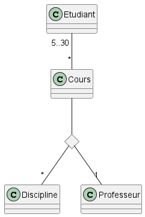

# Diagramme de classe

## Vrai ou faux

Etant donné le diagramme de domaine ci-dessus, les assertions suivantes sont-elles vraies ou fausses ? 
- Etudiant est une classe d’association: FAUX
- Un étudiant peut participer à autant de cours qu’il veut: VRAI
- Plusieurs professeurs peuvent enseigner la même discipline: NON
- Un professeur peut enseigner plusieurs disciplines: VRAI
- Un cours peut être enseigner à 2 étudiants: FAUX
- Un cours peut être enseigner à 20 étudiants: VRAI

## Question ouverte

Représentez la même association avec la notation UML « petit losange » 

- Quelles informations perd-on par rapport au diagramme ci-dessus ? 

La clarté du fait qu'une discipline est enseignée par un seul professeur.